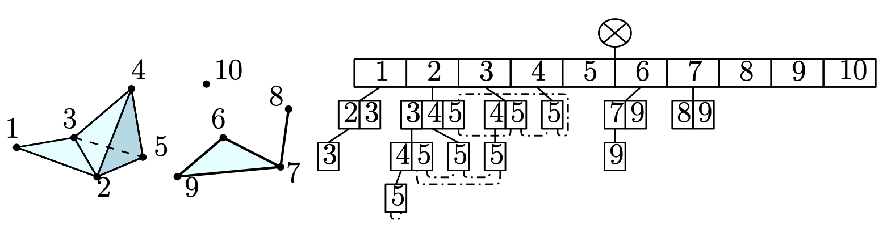
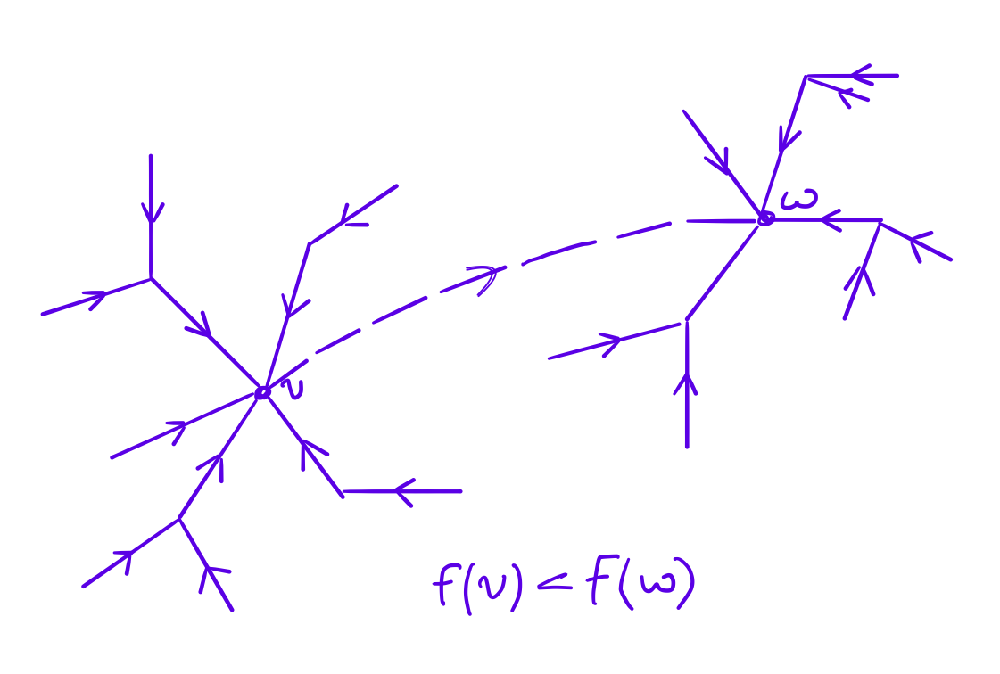

Description
===========
Here we provide a description and explanation of constructions that we use in GalaxyWitness  

About witness complex
---------------------

The witness complex :math:`\mathrm{Wit}(L,W)` (a "discrete" analogue of the Delaunay complex) this is a simplicial complex defined by two sets in :math:`\mathbb{R}^d`:

* :math:`L` - the set of landmarkets
* :math:`W` - the set of witnesses

We will also assume that :math:`L\subseteq W`. The vertices of :math:`\mathrm{Wit}(L,W)` are the set :math:`L`.
The complex :math:`\mathrm{Wit}(L,W)` is a flag simplicial complex consisting of all simplices :math:`\tau` such that the following condition holds for any simplex :math:`\sigma\subseteq\tau`:

.. math::

   \exists w: \quad\|w-p\| \leq\|w-q\|\quad\forall p\in \sigma\text { and } \forall q\in L
	 
Now we similarly introduce the complex :math:`\mathrm{Wit}^{\alpha}(L,W)`, defined by the condition:

.. math::

   \exists w: \quad\|w-p\|\leq\|w-q\| + \alpha\quad\forall p \in \sigma\text { and } \forall q\in L
	 
Varying the parameter :math:`\alpha`, we get the filtering of witness complex:

.. math::

   \alpha_1 \leq\alpha_2 \Rightarrow\mathrm{Wit}^{\alpha_1}(L,W)\subseteq\mathrm{Wit}^{\alpha_2}(L,W)

About simplex tree
------------------

Let :math:`K` be a simplicial complex with :math:`n` vertices.
Recall that by filtering we mean the function :math:`f:K\to\mathbb{R}`, such that :math:`f(\sigma)\leq f(\tau)` only if :math:`\sigma\subseteq\tau`.

A simplex tree is `Trie (prefix tree) <https://en.wikipedia.org/wiki/Trie>`_, in which the keys are words (simplices) in the alphabet :math:`1,...,n`, and the values are the filtering values :math:`f`

	 
	 Simplicial complex and its simplex tree: all values equals 1

You can read more about the simplex tree in the article:

`Jean-Daniel Boissonnat (DATASHAPE, Inria), Clément Maria (DATASHAPE, Inria). The Simplex Tree: an Efficient Data Structure for General Simplicial Complexes: <https://arxiv.org/pdf/2001.02581.pdf>`_

About clustering (ToMATo)
-------------------------

ToMATo is a clustering algorithm. ToMATo starts with `graph k nearest neighbors <https://en.wikipedia.org/wiki/Nearest_neighbor_graph>`_ , then using the density function defined on the point cloud, combines the pieces of the original graph and obtains the required clustering (which is determined by the number of clusters and/or the threshold of significance per density function). This algorithm is a composition of two ideas: `Union-find forest <https://en.wikipedia.org/wiki/Disjoint-set_data_structure>`_ and `Morse theory <https://en.wikipedia.org/wiki/Morse_theory>`_.
Let :math:`f` be a density function. Let's describe the steps of the algorithm:

* We construct a graph :math:`G` (:math:`k` nearest neighbors or a Rips graph with the parameter :math:`\delta`).
* Passing through the vertices of the graph: connect the current vertex :math:`v` with the neighboring :math:`w` if :math`f(w)` is the largest value of :math:`f` among the vertices adjacent to the vertex :math:`v`. We get a spanning forest on the vertices of the original graph :math:`G`. Moreover, the root of each tree will be a vertex with a local maximum of the density function.
* We combine trees whose roots have a small value of the density function. Namely, we connect the roots of two trees from the root with a smaller value of the density function to the function with a larger value of the density function. We continue until the required clustering is obtained.

You can read more about ToMATo in the article:

`Frédéric Chazal, Leonidas Guibas, Steve Oudot, Primoz Skraba. Persistence-Based Clustering in Riemannian Manifolds <https://hal.inria.fr/inria-00389390/document>`_

	 
	 Merge of two trees 

About Delaunay triangulation
----------------------------

Coming soon...